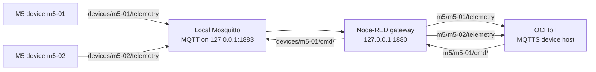

# Node-RED Gateway Sample

This sample runs a local Node-RED gateway that bridges a plain local MQTT
network to OCI IoT over MQTTS. The gateway is a digital twin instance with
`GATEWAY` connectivity. The two M5 environmental devices are digital twin
instances with `INDIRECT` connectivity and are linked to the gateway with
`--gateways`.



## Prerequisites

- OCI CLI configured with access to create and read IoT resources.
- An existing OCI IoT Domain.
- A Vault Secret for gateway Basic auth. The secret value is the password used
  by Node-RED when it connects to the OCI IoT device host.
- Docker, Podman Compose, or Podman Quadlet.

Do not put real OCIDs or secret values in source control. Use shell variables
and the local `.env` file.

## OCI CLI Setup

The setup below uses OCI CLI commands so the sample is reproducible and easy to
repeat. If you prefer, you can use the OCI Console to create the same models,
adapters, gateway instance, indirect device instances, gateway link, and Basic
auth secret.

Run the commands from this directory:

```sh
cd samples/node/node-red-gateway
```

Set the common variables for your tenancy, profile, region, IoT Domain, and
gateway Vault Secret. These values do not need to be exported; they are shell
variables for this terminal session:

```sh
OCI_CLI_PROFILE=<oci-profile>
OCI_REGION=<region>
IOT_DOMAIN_ID=<iot-domain-ocid>
GATEWAY_SECRET_ID=<vault-secret-ocid>
GATEWAY_EXTERNAL_KEY=nodered-gateway-01
GATEWAY_NAME="Node-RED gateway"
M5_MODEL_NAME="Node-RED M5 environment"
M5_ADAPTER_NAME="Node-RED M5 adapter"
```

Create the gateway model from the DTDL file:

```sh
oci iot digital-twin-model create \
  --profile "${OCI_CLI_PROFILE}" \
  --region "${OCI_REGION}" \
  --iot-domain-id "${IOT_DOMAIN_ID}" \
  --display-name "${GATEWAY_NAME} model" \
  --spec file://data/gateway-model.json \
  --wait-for-state ACTIVE
```

Get the gateway model OCID:

```sh
GATEWAY_MODEL_ID=$(oci iot digital-twin-model list \
  --profile "${OCI_CLI_PROFILE}" \
  --region "${OCI_REGION}" \
  --iot-domain-id "${IOT_DOMAIN_ID}" \
  --display-name "${GATEWAY_NAME} model" \
  --lifecycle-state ACTIVE \
  --query 'data.items[0].id' \
  --raw-output)
```

Create the gateway adapter with the envelope and routes files:

```sh
oci iot digital-twin-adapter create \
  --profile "${OCI_CLI_PROFILE}" \
  --region "${OCI_REGION}" \
  --iot-domain-id "${IOT_DOMAIN_ID}" \
  --display-name "${GATEWAY_NAME} adapter" \
  --digital-twin-model-id "${GATEWAY_MODEL_ID}" \
  --inbound-envelope file://data/gateway-adapter-envelope.json \
  --inbound-routes file://data/gateway-adapter-routes.json \
  --wait-for-state ACTIVE
```

The gateway adapter envelope maps `target` from M5 endpoint paths. When the
gateway publishes `m5/m5-01/telemetry`, OCI resolves `m5-01` as the indirect
device external key and delegates the payload to that device's M5 adapter.
Gateway metrics resolve to a null target, so they remain gateway telemetry.

Get the gateway adapter OCID:

```sh
GATEWAY_ADAPTER_ID=$(oci iot digital-twin-adapter list \
  --profile "${OCI_CLI_PROFILE}" \
  --region "${OCI_REGION}" \
  --iot-domain-id "${IOT_DOMAIN_ID}" \
  --display-name "${GATEWAY_NAME} adapter" \
  --lifecycle-state ACTIVE \
  --query 'data.items[0].id' \
  --raw-output)
```

Create the gateway instance with `--connectivity-type GATEWAY`:

```sh
oci iot digital-twin-instance create \
  --profile "${OCI_CLI_PROFILE}" \
  --region "${OCI_REGION}" \
  --iot-domain-id "${IOT_DOMAIN_ID}" \
  --display-name "${GATEWAY_NAME}" \
  --digital-twin-model-id "${GATEWAY_MODEL_ID}" \
  --digital-twin-adapter-id "${GATEWAY_ADAPTER_ID}" \
  --connectivity-type GATEWAY \
  --external-key "${GATEWAY_EXTERNAL_KEY}" \
  --auth-id "${GATEWAY_SECRET_ID}" \
  --wait-for-state ACTIVE
```

Get the gateway OCID:

```sh
GATEWAY_INSTANCE_ID=$(oci iot digital-twin-instance list \
  --profile "${OCI_CLI_PROFILE}" \
  --region "${OCI_REGION}" \
  --iot-domain-id "${IOT_DOMAIN_ID}" \
  --display-name "${GATEWAY_NAME}" \
  --lifecycle-state ACTIVE \
  --query 'data.items[0].id' \
  --raw-output)
```

For local devices, this sample uses one M5 model and one M5 adapter shared by
`m5-01` and `m5-02`. That keeps the sample focused on `GATEWAY` and `INDIRECT`
connectivity. You can extend the sample by creating additional models and
adapters for other payload schemas and adding matching topic mappings in
Node-RED.

Create the M5 model:

```sh
oci iot digital-twin-model create \
  --profile "${OCI_CLI_PROFILE}" \
  --region "${OCI_REGION}" \
  --iot-domain-id "${IOT_DOMAIN_ID}" \
  --display-name "${M5_MODEL_NAME}" \
  --spec file://data/m5-model.json \
  --wait-for-state ACTIVE
```

Get the M5 model OCID:

```sh
M5_MODEL_ID=$(oci iot digital-twin-model list \
  --profile "${OCI_CLI_PROFILE}" \
  --region "${OCI_REGION}" \
  --iot-domain-id "${IOT_DOMAIN_ID}" \
  --display-name "${M5_MODEL_NAME}" \
  --lifecycle-state ACTIVE \
  --query 'data.items[0].id' \
  --raw-output)
```

Create the M5 adapter:

```sh
oci iot digital-twin-adapter create \
  --profile "${OCI_CLI_PROFILE}" \
  --region "${OCI_REGION}" \
  --iot-domain-id "${IOT_DOMAIN_ID}" \
  --display-name "${M5_ADAPTER_NAME}" \
  --digital-twin-model-id "${M5_MODEL_ID}" \
  --inbound-envelope file://data/m5-adapter-envelope.json \
  --inbound-routes file://data/m5-adapter-routes.json \
  --wait-for-state ACTIVE
```

Get the M5 adapter OCID:

```sh
M5_ADAPTER_ID=$(oci iot digital-twin-adapter list \
  --profile "${OCI_CLI_PROFILE}" \
  --region "${OCI_REGION}" \
  --iot-domain-id "${IOT_DOMAIN_ID}" \
  --display-name "${M5_ADAPTER_NAME}" \
  --lifecycle-state ACTIVE \
  --query 'data.items[0].id' \
  --raw-output)
```

Create two indirect M5 instances with `--connectivity-type INDIRECT` and
`--gateways`:

```sh
for DEVICE_ID in m5-01 m5-02; do
  oci iot digital-twin-instance create \
    --profile "${OCI_CLI_PROFILE}" \
    --region "${OCI_REGION}" \
    --iot-domain-id "${IOT_DOMAIN_ID}" \
    --display-name "${DEVICE_ID}" \
    --digital-twin-model-id "${M5_MODEL_ID}" \
    --digital-twin-adapter-id "${M5_ADAPTER_ID}" \
    --connectivity-type INDIRECT \
    --external-key "${DEVICE_ID}" \
    --gateways "[\"${GATEWAY_INSTANCE_ID}\"]" \
    --wait-for-state ACTIVE
done
```

Retrieve the domain device host for the `.env` file:

```sh
IOT_DEVICE_HOST=$(oci iot domain get \
  --profile "${OCI_CLI_PROFILE}" \
  --region "${OCI_REGION}" \
  --iot-domain-id "${IOT_DOMAIN_ID}" \
  --query 'data."device-host"' \
  --raw-output)
```

Retrieve the gateway Vault Secret contents. The value becomes
`IOT_GATEWAY_SECRET` in `.env`:

```sh
IOT_GATEWAY_SECRET=$(oci secrets secret-bundle get \
  --profile "${OCI_CLI_PROFILE}" \
  --region "${OCI_REGION}" \
  --secret-id "${GATEWAY_SECRET_ID}" \
  --query 'data."secret-bundle-content".content' \
  --raw-output | base64 --decode)
```

## Runtime Setup

Copy the environment template and fill in the values from the OCI setup:

```sh
cp .env.example .env
```

Set these values:

```sh
IOT_DEVICE_HOST=<domain-short-id>.device.iot.<region>.oci.oraclecloud.com
IOT_GATEWAY_EXTERNAL_KEY=nodered-gateway-01
IOT_GATEWAY_SECRET=<gateway-secret-contents>
LOCAL_MQTT_HOST=mosquitto
LOCAL_MQTT_PORT=1883
GATEWAY_METRICS_INTERVAL_SECONDS=60
```

Start with Docker Compose:

```sh
docker compose up
```

Start with Podman Compose:

```sh
podman compose up
```

Start with Podman Quadlet by following [quadlet/README.md](quadlet/README.md).
The Quadlet files use the same environment keys.

Node-RED is available at `http://127.0.0.1:1880`. Local Mosquitto listens on
`127.0.0.1:1883` and both services use localhost by default. These defaults
keep the sample local to the host. If LAN devices need to publish to Mosquitto,
change the Mosquitto port binding in Docker Compose or Quadlet only inside a
secure local zone.

Docker Compose and Podman Quadlet seed the Node-RED flow and credential
template into a named volume on first startup. If you change `flows/flows.json`
or `flows/flows_cred.template.json` and want to reload the sample from
scratch, stop the containers and remove the runtime volume before starting
again.

## Local MQTT Topic Contract

Local devices publish plain MQTT to Mosquitto:

| Direction | Topic | Payload |
|-----------|-------|---------|
| M5 telemetry | `devices/m5-01/telemetry` | JSON M5 telemetry |
| M5 telemetry | `devices/m5-02/telemetry` | JSON M5 telemetry |
| Command to local M5 | `devices/<device-id>/cmd/<key>` | JSON command |
| Response from local M5 | `devices/<device-id>/rsp/<key>` | JSON response |

The telemetry payload includes `time`, `sht_temperature`, `qmp_temperature`,
`humidity`, `pressure`, and `count`.

## OCI Endpoint Contract

Node-RED forwards local traffic to these OCI endpoints:

| Direction | OCI endpoint |
|-----------|--------------|
| Gateway metrics | `gateway/metrics` |
| M5 telemetry | `m5/m5-01/telemetry` |
| M5 telemetry | `m5/m5-02/telemetry` |
| Command request | `m5/m5-01/cmd/<key>` |
| Command request | `m5/m5-02/cmd/<key>` |
| Command response | `m5/m5-01/rsp/<key>` |
| Command response | `m5/m5-02/rsp/<key>` |

The gateway adapter maps `m5/<device-id>/...` endpoints to indirect device
targets. `gateway/metrics` does not resolve to an indirect target, so it remains
gateway telemetry. The explicit gateway metrics route maps the metrics fields
and the `system` object; the fallback route stores full unmatched payloads in
`system`.

## Simulators

The Node-RED flow includes simulators for `m5-01` and `m5-02`.

- Open Node-RED at `http://127.0.0.1:1880`.
- Use the Simulators tab to start each device telemetry loop.
- Use the Examples tab to inject sample telemetry, command responses, and
  counter resets.
- Watch Node status badges under function nodes for handled-message counters.
- On the Examples tab, watch the debug sidebar to inspect example payloads.

The simulators subscribe to local command topics such as `devices/m5-01/cmd/abc`
and publish responses to `devices/m5-01/rsp/abc`.

## Real Local Devices

Real local devices can replace the simulators when they publish and subscribe to
the same local MQTT contract.

- Publish telemetry to `devices/<device-id>/telemetry`.
- Subscribe to `devices/<device-id>/cmd/+`.
- Publish command acknowledgements or results to `devices/<device-id>/rsp/<key>`.
- Use `m5-01` and `m5-02` unless you also update the Node-RED allow list and
  create matching OCI indirect digital twin instances.

For LAN-connected devices, expose Mosquitto beyond `127.0.0.1` only on a secure
local network segment. The sample Mosquitto listener permits anonymous local
MQTT and is not intended for untrusted networks.

## Verification

Get the latest gateway content:

```sh
oci iot digital-twin-instance get-content \
  --profile "${OCI_CLI_PROFILE}" \
  --region "${OCI_REGION}" \
  --digital-twin-instance-id "${GATEWAY_INSTANCE_ID}"
```

Get the indirect M5 instance OCIDs:

```sh
M5_01_INSTANCE_ID=$(oci iot digital-twin-instance list \
  --profile "${OCI_CLI_PROFILE}" \
  --region "${OCI_REGION}" \
  --iot-domain-id "${IOT_DOMAIN_ID}" \
  --display-name m5-01 \
  --lifecycle-state ACTIVE \
  --query 'data.items[0].id' \
  --raw-output)

M5_02_INSTANCE_ID=$(oci iot digital-twin-instance list \
  --profile "${OCI_CLI_PROFILE}" \
  --region "${OCI_REGION}" \
  --iot-domain-id "${IOT_DOMAIN_ID}" \
  --display-name m5-02 \
  --lifecycle-state ACTIVE \
  --query 'data.items[0].id' \
  --raw-output)
```

Get content for each indirect M5 device:

```sh
oci iot digital-twin-instance get-content \
  --profile "${OCI_CLI_PROFILE}" \
  --region "${OCI_REGION}" \
  --digital-twin-instance-id "${M5_01_INSTANCE_ID}"

oci iot digital-twin-instance get-content \
  --profile "${OCI_CLI_PROFILE}" \
  --region "${OCI_REGION}" \
  --digital-twin-instance-id "${M5_02_INSTANCE_ID}"
```

Invoke an identify command for `m5-01` with matching request and response
endpoints:

```sh
oci iot digital-twin-instance invoke-raw-json-command \
  --profile "${OCI_CLI_PROFILE}" \
  --region "${OCI_REGION}" \
  --digital-twin-instance-id "${M5_01_INSTANCE_ID}" \
  --request-endpoint "m5/m5-01/cmd/identify-001" \
  --request-duration "PT10M" \
  --response-endpoint "m5/m5-01/rsp/identify-001" \
  --response-duration "PT10M" \
  --request-data file://data/m5-identify-command.json
```

Invoke the matching command for `m5-02`:

```sh
oci iot digital-twin-instance invoke-raw-json-command \
  --profile "${OCI_CLI_PROFILE}" \
  --region "${OCI_REGION}" \
  --digital-twin-instance-id "${M5_02_INSTANCE_ID}" \
  --request-endpoint "m5/m5-02/cmd/identify-002" \
  --request-duration "PT10M" \
  --response-endpoint "m5/m5-02/rsp/identify-002" \
  --response-duration "PT10M" \
  --request-data file://data/m5-identify-command.json
```

Use `data/m5-set-interval-command.json` in the same pattern to change a
simulator telemetry interval. A raw command accepted by OCI confirms command
submission only; verify final delivery by watching the local MQTT response topic
or by querying raw command data in your IoT data store.

## Troubleshooting

OCI MQTT connection failure:

- Confirm `IOT_DEVICE_HOST` is the `data."device-host"` value from the IoT
  Domain and that outbound TCP 8883 is allowed.
- Confirm the gateway instance is ACTIVE and has `GATEWAY` connectivity.
- Check the Node-RED log for TLS or MQTT authentication errors.

Wrong gateway credentials:

- Confirm `IOT_GATEWAY_EXTERNAL_KEY` matches the gateway instance external key.
- Confirm `IOT_GATEWAY_SECRET` is the decoded Vault Secret value.
- Confirm the gateway instance `--auth-id` points to the intended Vault Secret.
- Confirm `flows/flows_cred.template.json` still contains the
  `${IOT_GATEWAY_EXTERNAL_KEY}` and `${IOT_GATEWAY_SECRET}` placeholders if you
  are reseeding the Node-RED data volume.

Indirect device telemetry not updating:

- Confirm each indirect device was created with `--connectivity-type INDIRECT`
  and `--gateways "[\"${GATEWAY_INSTANCE_ID}\"]"`.
- Confirm the local topic is `devices/m5-01/telemetry` or
  `devices/m5-02/telemetry`.
- Confirm the gateway publishes to `m5/m5-01/telemetry` or
  `m5/m5-02/telemetry`.

Local Mosquitto topic mismatch:

- Use the Examples tab in Node-RED to inspect expected local topics.
- Check that real devices use `devices/<device-id>/telemetry`,
  `devices/<device-id>/cmd/+`, and `devices/<device-id>/rsp/<key>`.

Commands accepted by OCI but not observed locally:

- Confirm the request endpoint matches the device, for example
  `m5/m5-01/cmd/identify-001`.
- Confirm the response endpoint uses the same key, for example
  `m5/m5-01/rsp/identify-001`.
- Confirm the device ID is in the Node-RED allowed-device list.
- Watch Mosquitto or Node-RED debug output for `devices/m5-01/cmd/identify-001`.

## Security

Local MQTT is plain because the sample assumes Mosquitto and devices run inside
a secure local zone. The OCI connection uses MQTTS on port 8883.

For simplicity, this sample uses a Vault Secret and Basic auth for the gateway
connection. Certificate-based gateway authentication, including MQTT
certificates in Node-RED, is a natural topic for a later addendum.
